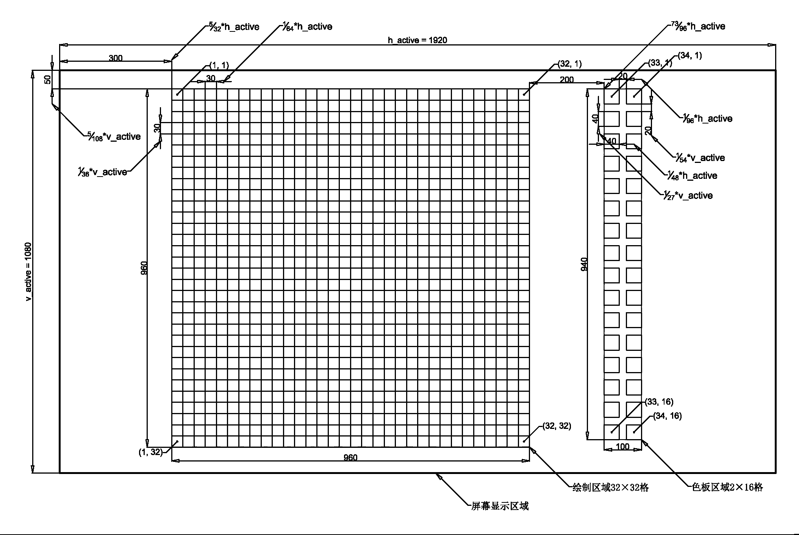
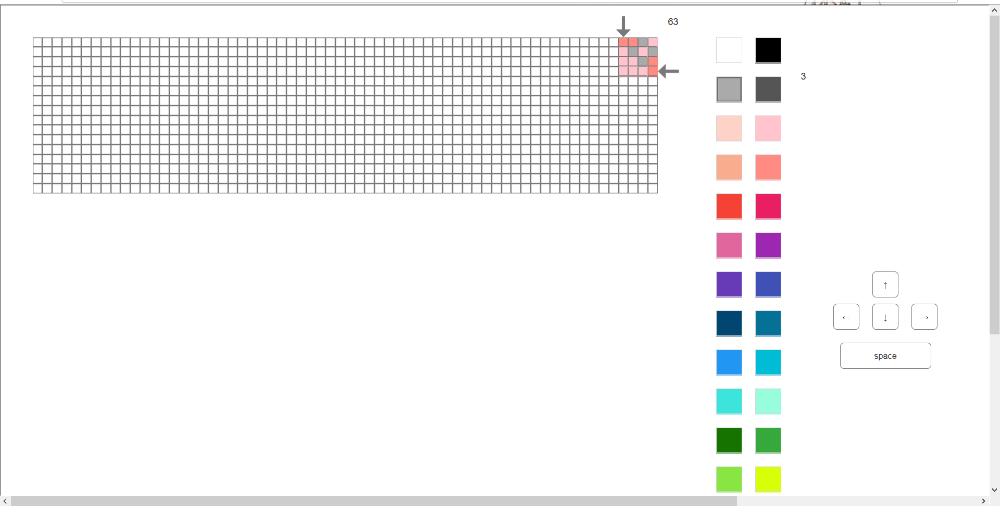

# pixel-art-drawing

a FPGA based pixel art drawing platform

一个基于FPGA系统的像素画绘制平台

## start up

- 开发板平台：ALINX AX4010 with Cyclone IV EP4CE10F17C8N

- PS/2键盘输入，VGA/HDMI均可输出显示

## system structure

1. ps/2 keyboard read & decode: decode key up, down, left, right, space and more
    - top_ps2key_module.vhd (create from bdf file)
        - ps2_read.vhd
        - ps2_decode.vhd
2. color select: press key space to choose color
    - color_ctrl.vhd
3. coordinate pointer: indicate the active area
    - pointer.vhd
4. draw control & storage: use key up, down, left, right to select the area, press key space to paint it
    - img_ctrl.vhd
    - 2-port ram (ip core)
5. LED digital display: display the pointer location and the current color No.
    - top_smg_display.vhd (create from bdf file)
        - ctrl_info_to_smg_data.vhd
        - smg_6.vhd
6. contral infomation buffer: for clock domain crossing problem
    - ctrl_info_buffer.vhd (create from bdf file)
        - ctrl_ram_wr.vhd
        - ctrl_ram (IP core)
        - ctrl_ram_rd.vhd
7. generate VGA signal (in RGB888): raw image signal ready to display on the screen
    - vga_signal_gen.vhd
8. VGA signal out: RGB888 to RGB565
    - vga_port_out.vhd
9. DVI (HDMI) signal out: TMDS encode
    - top_dvi_encode.vhd (create from bdf file)
        - dvi_encoder.v
        - par10bit_to_ddr_signal.vhd
        - ddr_out (ALTDDIO-OUT IP core)
        - ser_to_diffser (ALTIOBUF IP core)

    1--> 2

    &ensp;--> 3

    &ensp;--> 4

    2--> 5

    &ensp;--> 6

    3--> 5

    &ensp;--> 6

    4--> 7

    6--> 7

    7--> 8

    &ensp;--> 9

    ## prototype design

    ### UI layout design

    see prototype/layout-Model.png

    

    ### HTML based prototype

    see prototype/html/page_1.html

    

    ## 系统功能

    1. 光标显示

        在当前活动区域显示红色矩形光标

        - 光标颜色由 vga_signal_gen.vhd: constant color_sel_r, constant color_sel_g, constant color_sel_b 定义
        - 光标相对大小于 vga_signal_gen.vhd: img_gen 进程中控制

    2. 光标位置控制

        使用 UP ARROW, DOWN ARROW, LEFT ARROW, RIGHT ARROW 控制光标每次移动1格，使用 W, A, S, D 控制光标每次移动5格

        - 光标行为于 pointer.vhd: point 进程中控制

    3. 颜色选择

        当活动区域位于颜色选择区域时，使用 SPACE 或 B 指定当前光标下颜色为画笔颜色（前景色），使用 E 指定当前光标下颜色为橡皮擦颜色（背景色）

        - 颜色选择行为于 color_ctrl.vhd: color_sel 进程中控制

    4. 绘制

        当活动区域位于绘制区域时，使用 B 选择使用画笔（前景色），使用 E 选择使用橡皮擦（背景色），使用 SPACE 向当前光标下区域绘制颜色，使用 CTRL + D （其中 CTRL 为粘滞键模式）用当前颜色覆写整个绘制区域

        - 绘制行为于 img_ctrl.vhd: img_ctrl 进程中控制

    5. 绘制信息保存（未实现）

    6. 绘制信息加载（未实现）